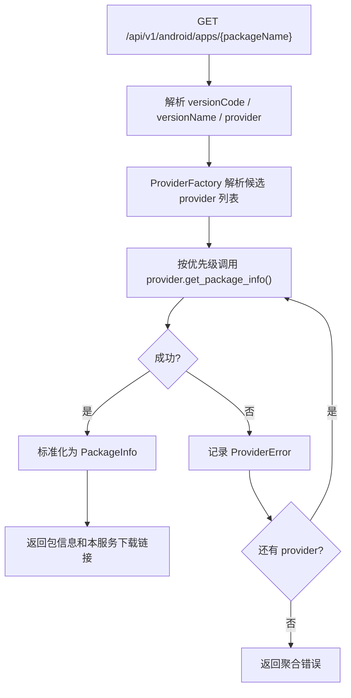
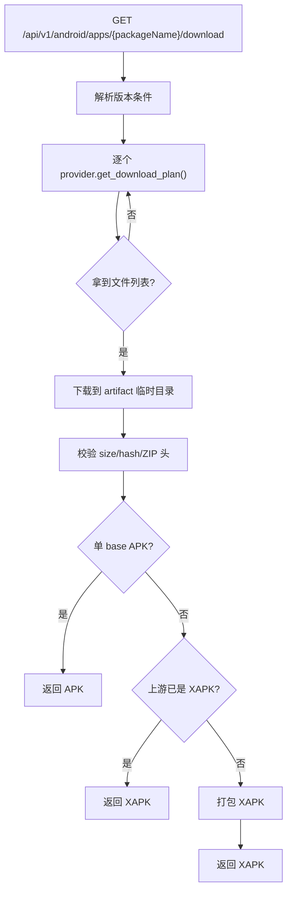

# Android 包信息与下载服务系统设计

## 定位

这是一个独立后端服务，作为单独项目开发和部署。

服务以 Docker Compose 方式部署在服务器上，对外提供 HTTP API：

- 通过 Android 包名查询包信息。
- 通过包名加可选版本号或版本名下载最终安装包。
- 所有来源按 Provider 抽象，工厂按优先级逐个尝试，直到成功。
- 覆盖 docs 调研中的所有下载方式，而不是只挑一个实现。

## 目标能力

查询包信息时返回：

- 包名
- 应用名
- 当前应用版本名
- 当前应用版本号
- 下载链接
- 历史版本记录：版本号、版本名、下载链接，尽量支持

下载最终文件时：

- 单 APK 直接返回 `.apk`
- APKPure 已经返回 `.xapk` / `.apks` 时，校验后按原归档类型返回
- Google Play / Aptoide / split APK / OBB / patch 等多文件形态，统一打包成 `.xapk`

版本参数：

- `packageName` 必传
- `versionCode` 可选
- `versionName` 可选
- 都不传时默认取最新版本

## 技术选型

推荐：

```text
Python 3.12
FastAPI
Uvicorn / Gunicorn
httpx
Pydantic
Playwright
gpapi
Docker Compose
```

选择理由：

- docs 中已有多条 Python 路径：`mobile-app-download`、APKPure signed API、APKPure protobuf API、Aptoide MCP。
- Python 更容易复用或迁移现有调研代码，包括 `gpapi`、Playwright 下载兜底、代理探测和签名逻辑。
- Google Play 下载路径优先使用 Python `gpapi` + Aurora dispenser，便于在服务端容器内运行。
- FastAPI 足够轻量，接口定义清晰，Docker 部署简单。
- 不引入数据库、任务队列、微服务拆分，先把可用下载链路做稳。

第一版不做：

- 不做用户系统。
- 不做复杂任务队列。
- 不做全量版本数据库。
- 不做多实例共享缓存。
- 不做长期 CDN 镜像。

## 项目结构

建议新建独立项目目录：

```text
android-package-service/
  app/
    main.py
    api/
      routes.py
      schemas.py
      errors.py
    core/
      config.py
      logging.py
    domain/
      models.py
      result.py
      errors.py
    providers/
      base.py
      factory.py
      aptoide.py
      apkpure_signed.py
      apkpure_proto.py
      apkpure_web.py
      google_play.py
    download/
      downloader.py
      verifier.py
      artifact_store.py
      xapk_builder.py
    utils/
      hashing.py
      filenames.py
      zip_utils.py
  tests/
  Dockerfile
  docker-compose.yml
  pyproject.toml
  README.md
```

## Provider 覆盖范围

需要实现 docs 中的所有方式：

| Provider | 来源 | 必做能力 |
| --- | --- | --- |
| `google-play` | Aurora dispenser + Python `gpapi` | Google Play 详情、已知 versionCode 下载、base/split/OBB/patch 文件列表 |
| `aptoide` | Aptoide V7 API | 最新版、历史版本、base APK、AAB splits、OBB、md5 校验 |
| `apkpure-signed` | `tapi.pureapk.com/v3/get_app_detail` | 最新版信息、APK/XAPK 下载 URL、size/sha1 校验 |
| `apkpure-proto` | `api.pureapk.com/m/v3/cms/app_version` | 历史版本名列表、按 versionName 获取 APK/XAPK |
| `apkpure-web` | APKPure 网页 + Playwright | 搜索、详情页、下载页、CDN 兜底 |

默认优先级建议：

```text
apkpure-signed -> google-play -> aptoide -> apkpure-proto -> apkpure-web
```

说明：

- APKPure signed 最新版链路轻量且能直接给 APK/XAPK/APKS，优先尝试。
- Google Play 更接近官方来源，但依赖 Aurora token 和 gpapi，放在 signed 之后。
- Aptoide 对历史版本和 split 支持最好，是重要兜底。
- APKPure signed/proto/web 三条路径互补，全部纳入 Provider。
- Playwright 网页路径较重，可默认启用但放最低优先级，或通过配置允许关闭。

## 核心流程

### 查询包信息



### 下载包文件



## 统一数据模型

```python
from pydantic import BaseModel, Field


class AndroidPackageRequest(BaseModel):
    package_name: str
    version_code: int | None = None
    version_name: str | None = None
    preferred_provider: str | None = None


class PackageVersion(BaseModel):
    version_code: int | None = None
    version_name: str | None = None
    download_url: str | None = None
    provider_version_id: str | None = None


class AndroidPackageInfo(BaseModel):
    package_name: str
    app_name: str
    version_name: str | None
    version_code: int | None
    provider: str
    download_url: str
    versions: list[PackageVersion] = Field(default_factory=list)


class PackageFile(BaseModel):
    type: str
    name: str
    source_type: str = "url"
    url: str | None = None
    fallback_urls: list[str] = Field(default_factory=list)
    size: int | None = None
    md5: str | None = None
    sha1: str | None = None
    sha256: str | None = None
    split_name: str | None = None
    split_type: str | None = None
    metadata: dict[str, str] = Field(default_factory=dict)


class DownloadPlan(BaseModel):
    package_name: str
    app_name: str
    version_name: str | None
    version_code: int | None
    provider: str
    files: list[PackageFile]
```

`PackageFile.type` 第一版只使用这些值：

```text
BASE_APK
SPLIT_APK
OBB_MAIN
OBB_PATCH
XAPK
APKS
```

`fallback_urls` 用于 Aptoide `file.path_alt` 这类同一文件备用地址。`metadata` 只放内部排查字段，例如
`store.name`、`file.signature`、`malware.rank`，默认不进入公开 API。

`source_type` 默认是 `url`。如果 Google Play `gpapi` 只能给 `data` 流或 URL + cookie，先在
Google provider 适配成公共下载层支持的内部文件源，仍然走 `FileVerifier` 和 `ArtifactStore`，
不要让 provider 自己写最终文件。

`download_url` 一律返回本服务代理下载链接，不长期暴露上游 CDN URL。

## 错误类型

Provider 内部统一映射为：

```text
NOT_FOUND       应用或指定版本不存在
NETWORK_ERROR   网络、超时、来源临时失败
AUTH_ERROR      来源鉴权失败，例如 Aurora anonymous token
BAD_RESPONSE    来源响应格式变化或字段缺失
VERIFY_FAILED   下载完成但 size/hash/ZIP 校验失败
UNSUPPORTED     来源存在该应用但不支持指定版本条件或文件形态
```

HTTP 映射：

```text
400  请求参数非法
404  所有 provider 都没有找到应用或版本
409  找到了应用但没有可下载文件
502  上游响应异常或下载校验失败
503  上游网络或鉴权服务临时不可用
```
